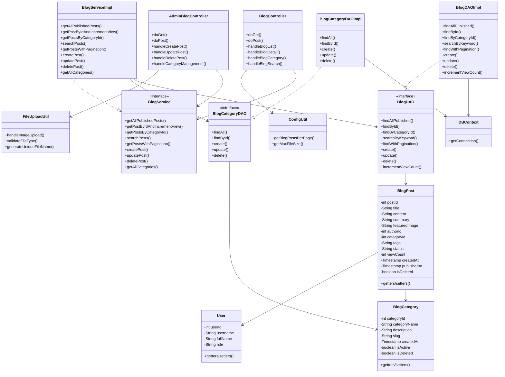
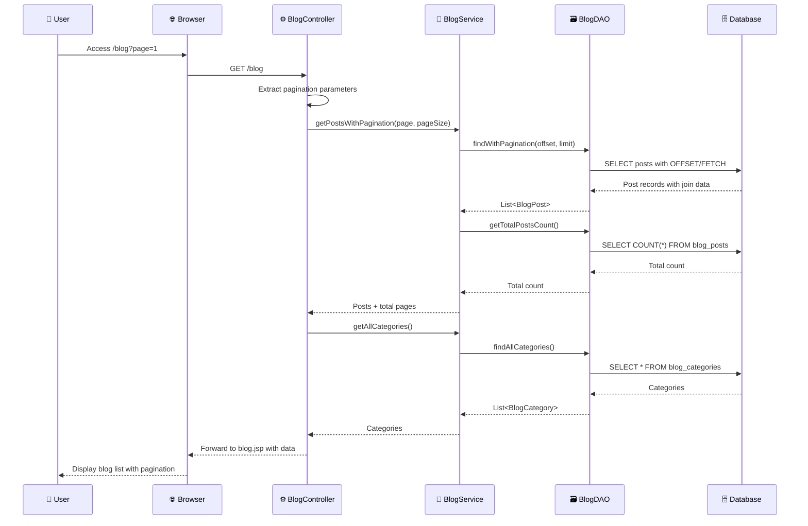
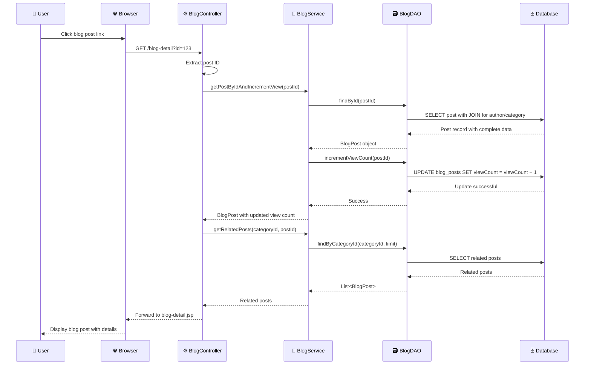
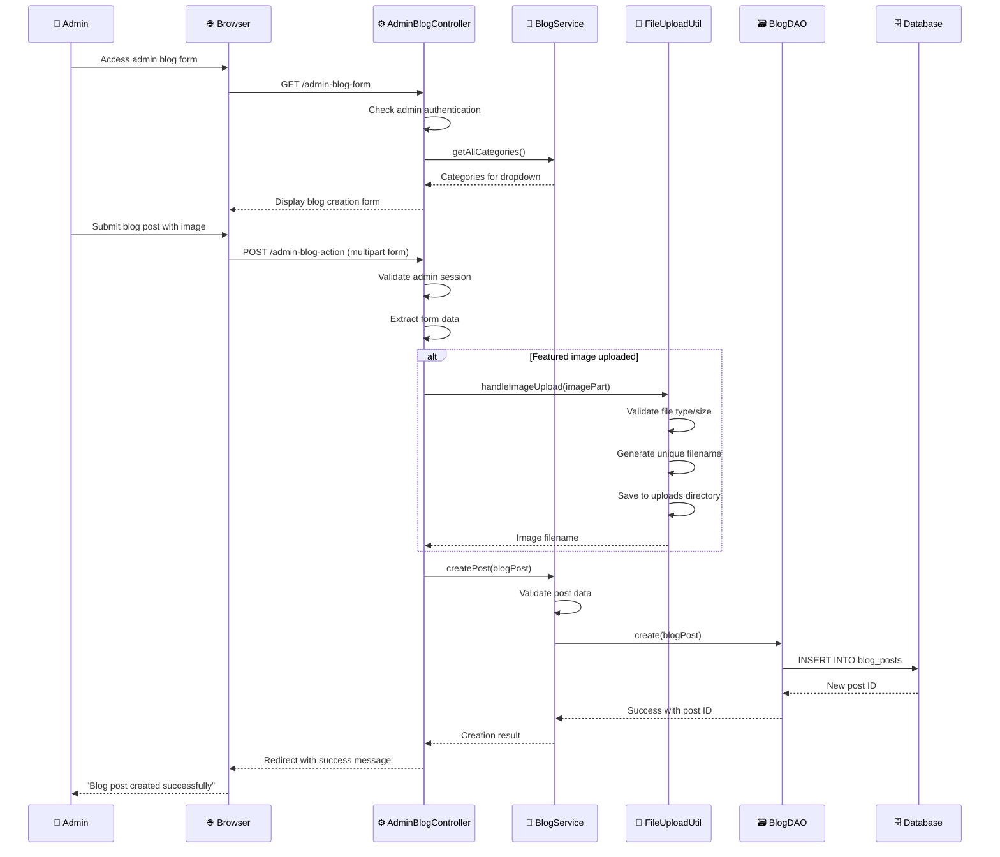

# Blog Management System - Class Diagrams và Specifications

## 📊 **Blog System - Class Diagram Summary**



## **b. Class Specifications - Blog Management System**

| **No** | **Method/Class** | **Description** |
|--------|------------------|-----------------|
| **01** | **BlogController** | This servlet handles HTTP requests for public blog functionality including blog listing, blog detail viewing, category filtering, and blog search. It processes GET/POST requests, manages pagination, handles view count increments, and provides blog content to end users with proper error handling and logging. |
| **02** | **AdminBlogController** | This servlet handles HTTP requests for admin blog management including creating new posts, editing existing posts, deleting posts, and managing blog categories. It requires admin authentication, processes file uploads for featured images, manages post status transitions, and provides comprehensive blog administration functionality. |
| **03** | **BlogPost** | The BlogPost entity class represents blog articles with properties including title, content, summary, featured image, author information, category assignment, tags, publication status, and view statistics. It supports draft/published workflow, audit timestamps, and soft delete functionality for comprehensive blog content management. |
| **04** | **BlogCategory** | The BlogCategory entity class represents blog categories with properties including category name, description, URL slug, and status flags. It supports hierarchical categorization, SEO-friendly URLs through slugs, and provides organizational structure for blog content with proper activation and deletion management. |
| **05** | **BlogService** | The BlogService interface defines business logic contracts for blog operations including content retrieval, search functionality, pagination management, content creation/modification, and category management. It abstracts blog business rules and provides clean separation between controllers and data access layers. |
| **06** | **BlogServiceImpl** | The BlogServiceImpl class implements comprehensive blog business logic including content validation, publication workflow, search algorithms, pagination calculations, author verification, and content security. It coordinates between multiple DAO layers and implements business rules for blog content management. |
| **07** | **BlogDAO** | The BlogDAO interface defines data access contracts for blog post operations including CRUD operations, search queries, pagination support, view count management, and status filtering. It abstracts database operations for blog content and provides foundation for different database implementations. |
| **08** | **BlogDAOImpl** | The BlogDAOImpl class provides concrete implementation of BlogDAO interface with SQL Server-specific queries. It handles complex blog queries including full-text search, pagination with proper sorting, join operations with users and categories, and optimized view count updates with database transaction management. |
| **09** | **BlogCategoryDAO** | The BlogCategoryDAO interface defines data access contracts for blog category operations including category CRUD operations, hierarchy management, and slug-based lookups. It supports category-based content organization and provides foundation for category management functionality. |
| **10** | **BlogCategoryDAOImpl** | The BlogCategoryDAOImpl class implements category data access with SQL Server queries including category creation with slug generation, hierarchy maintenance, and soft delete operations. It ensures category integrity and supports SEO-friendly URL generation through proper slug management. |
| **11** | **FileUploadUtil** | The FileUploadUtil utility class handles file upload operations for blog featured images including file validation, size checking, type verification, unique filename generation, and secure file storage. It supports multiple image formats and implements security measures to prevent malicious file uploads. |
| **12** | **ConfigUtil** | The ConfigUtil utility class manages blog configuration settings including posts per page, file size limits, allowed file types, and pagination settings. It centralizes configuration management and supports environment-specific settings for blog functionality. |

---

## **Method-Level Specifications - Blog System**

| **No** | **Method** | **Description** |
|--------|------------|-----------------|
| **01** | **BlogController.handleBlogList()** | Handles blog listing page with pagination support. Retrieves published posts using pagination parameters, calculates total pages, loads categories for filtering, gets latest posts for sidebar, and forwards to blog listing JSP with all necessary data for blog display. |
| **02** | **BlogController.handleBlogDetail()** | Processes blog detail page requests including post retrieval by ID, view count increment, related posts loading, and comment management. Validates post existence, handles SEO metadata, and forwards to blog detail JSP with comprehensive post information. |
| **03** | **BlogController.handleBlogCategory()** | Manages category-based blog filtering including category validation, post retrieval by category, pagination for category posts, and SEO-friendly URL handling. Loads category information and provides filtered blog content based on selected categories. |
| **04** | **BlogController.handleBlogSearch()** | Implements blog search functionality including keyword validation, full-text search execution, result pagination, and search result highlighting. Handles search queries with proper escaping and provides relevant blog content based on search terms. |
| **05** | **AdminBlogController.handleCreatePost()** | Manages new blog post creation including form validation, content processing, featured image upload, author assignment, category validation, and database insertion. Implements draft/publish workflow and provides comprehensive post creation functionality. |
| **06** | **AdminBlogController.handleUpdatePost()** | Processes blog post updates including existing post retrieval, permission validation, content modification, image replacement, status changes, and version tracking. Ensures only authorized users can modify posts with proper audit trail. |
| **07** | **AdminBlogController.handleDeletePost()** | Handles blog post deletion using soft delete approach including post validation, permission checking, status update to deleted, and audit logging. Maintains data integrity while allowing post recovery if needed. |
| **08** | **AdminBlogController.handleCategoryManagement()** | Manages blog category operations including category creation, editing, deletion, and hierarchy management. Validates category data, ensures unique slugs, and maintains category relationships with proper data integrity. |
| **09** | **BlogService.getAllPublishedPosts()** | Retrieves all published blog posts with author and category information. Filters out draft and deleted posts, includes join operations for complete post data, and returns properly formatted post list for public display. |
| **10** | **BlogService.getPostByIdAndIncrementView()** | Fetches specific blog post by ID and atomically increments view count. Validates post existence and published status, performs view count update, and returns complete post information with updated statistics. |
| **11** | **BlogService.getPostsByCategoryId()** | Retrieves blog posts filtered by category ID including category validation, post filtering by published status, and proper sorting. Returns categorized post list with complete post and category information. |
| **12** | **BlogService.searchPosts()** | Implements blog search logic including keyword processing, full-text search execution, result ranking, and relevance scoring. Handles multiple search terms and provides ranked search results with proper highlighting. |
| **13** | **BlogService.getPostsWithPagination()** | Manages paginated blog post retrieval including offset calculation, limit application, total count calculation, and page validation. Provides efficient pagination with proper sorting and filtering for large blog datasets. |
| **14** | **BlogService.createPost()** | Handles new blog post creation including content validation, author verification, category assignment, publication workflow, and audit trail creation. Implements business rules for post creation with proper error handling. |
| **15** | **BlogService.updatePost()** | Manages blog post updates including existing post validation, permission checking, content modification, status transition handling, and update timestamp management. Ensures data integrity during post modifications. |
| **16** | **BlogDAO.findAllPublished()** | Database query method that retrieves all published blog posts with JOIN operations for author and category information. Uses optimized SQL queries with proper indexing and filtering for published content only. |
| **17** | **BlogDAO.findById()** | Retrieves specific blog post by ID including all related information through JOIN operations. Uses parameterized queries for security and returns complete post object with author and category details. |
| **18** | **BlogDAO.searchByKeyword()** | Implements database-level full-text search using SQL Server full-text search capabilities. Searches across title, content, and tags fields with proper relevance ranking and result optimization. |
| **19** | **BlogDAO.findWithPagination()** | Executes paginated blog queries using SQL Server OFFSET and FETCH clauses. Implements efficient pagination with proper sorting, filtering, and total count calculation for large datasets. |
| **20** | **BlogDAO.incrementViewCount()** | Atomically increments blog post view count using SQL UPDATE statement. Uses proper locking mechanisms to prevent race conditions and ensures accurate view count tracking for blog analytics. |
| **21** | **BlogDAO.create()** | Inserts new blog post into database using parameterized INSERT statement. Handles auto-generated IDs, sets creation timestamps, and ensures data integrity with proper transaction management. |
| **22** | **BlogDAO.update()** | Updates existing blog post using parameterized UPDATE statement. Modifies specified fields while preserving original creation data and maintains audit trail with update timestamps. |
| **23** | **BlogDAO.delete()** | Implements soft delete for blog posts by updating isDeleted flag rather than removing records. Maintains data integrity and allows for post recovery while hiding deleted content from public view. |
| **24** | **BlogCategoryDAO.findAll()** | Retrieves all active blog categories with proper sorting and filtering. Returns category list for dropdown menus, navigation, and content organization with efficient database queries. |
| **25** | **FileUploadUtil.handleImageUpload()** | Processes uploaded images for blog featured images including file validation, size checking, format verification, unique filename generation, and secure file storage with proper error handling and cleanup. |

## 🔄 **Blog System Sequence Diagrams**

### **1. Blog List Viewing Sequence**



### **2. Blog Detail Viewing Sequence**



### **3. Admin Blog Creation Sequence**



## 🗄️ **Blog Database Queries**

### **Blog Post Queries**

#### **BlogDAOImpl.findAllPublished()**
```sql
SELECT bp.postId, bp.title, bp.content, bp.summary, bp.featuredImage,
       bp.authorId, u.fullName as authorName, bp.categoryId, 
       bc.categoryName, bp.tags, bp.status, bp.viewCount,
       bp.createdAt, bp.publishedAt
FROM blog_posts bp
JOIN users u ON bp.authorId = u.userId
LEFT JOIN blog_categories bc ON bp.categoryId = bc.categoryId
WHERE bp.status = 'published' AND bp.isDeleted = 0
ORDER BY bp.publishedAt DESC;
```

#### **BlogDAOImpl.findWithPagination()**
```sql
SELECT bp.postId, bp.title, bp.content, bp.summary, bp.featuredImage,
       bp.authorId, u.fullName as authorName, bp.categoryId, 
       bc.categoryName, bp.tags, bp.viewCount, bp.publishedAt
FROM blog_posts bp
JOIN users u ON bp.authorId = u.userId
LEFT JOIN blog_categories bc ON bp.categoryId = bc.categoryId
WHERE bp.status = 'published' AND bp.isDeleted = 0
ORDER BY bp.publishedAt DESC
OFFSET ? ROWS FETCH NEXT ? ROWS ONLY;
```

#### **BlogDAOImpl.searchByKeyword()**
```sql
SELECT bp.*, u.fullName as authorName, bc.categoryName
FROM blog_posts bp
JOIN users u ON bp.authorId = u.userId
LEFT JOIN blog_categories bc ON bp.categoryId = bc.categoryId
WHERE bp.status = 'published' AND bp.isDeleted = 0
AND (bp.title LIKE ? OR bp.content LIKE ? OR bp.tags LIKE ?)
ORDER BY bp.publishedAt DESC;
```

#### **BlogDAOImpl.incrementViewCount()**
```sql
UPDATE blog_posts 
SET viewCount = viewCount + 1 
WHERE postId = ?;
```

#### **BlogDAOImpl.create()**
```sql
INSERT INTO blog_posts 
(title, content, summary, featuredImage, authorId, categoryId, 
 tags, status, viewCount, createdAt, isDeleted)
VALUES (?, ?, ?, ?, ?, ?, ?, ?, 0, GETDATE(), 0);
```

### **Blog Category Queries**

#### **BlogCategoryDAOImpl.findAll()**
```sql
SELECT categoryId, categoryName, description, slug, createdAt
FROM blog_categories
WHERE isActive = 1 AND isDeleted = 0
ORDER BY categoryName;
```

#### **BlogCategoryDAOImpl.create()**
```sql
INSERT INTO blog_categories 
(categoryName, description, slug, createdAt, isActive, isDeleted)
VALUES (?, ?, ?, GETDATE(), 1, 0);
```

## 📊 **Blog Database Schema**

### **`blog_posts` table**
```sql
CREATE TABLE blog_posts (
    postId INT IDENTITY(1,1) PRIMARY KEY,
    title NVARCHAR(255) NOT NULL,
    content NTEXT NOT NULL,
    summary NVARCHAR(500),
    featuredImage NVARCHAR(255),
    authorId INT FOREIGN KEY REFERENCES users(userId),
    categoryId INT FOREIGN KEY REFERENCES blog_categories(categoryId),
    tags NVARCHAR(500),
    status NVARCHAR(20) DEFAULT 'draft', -- draft, published, archived
    viewCount INT DEFAULT 0,
    createdAt DATETIME DEFAULT GETDATE(),
    updatedAt DATETIME NULL,
    publishedAt DATETIME NULL,
    isDeleted BIT DEFAULT 0
);
```

### **`blog_categories` table**
```sql
CREATE TABLE blog_categories (
    categoryId INT IDENTITY(1,1) PRIMARY KEY,
    categoryName NVARCHAR(100) NOT NULL,
    description NVARCHAR(500),
    slug NVARCHAR(100) UNIQUE NOT NULL,
    createdAt DATETIME DEFAULT GETDATE(),
    isActive BIT DEFAULT 1,
    isDeleted BIT DEFAULT 0
);
```

### **Performance Indexes**
```sql
CREATE INDEX IX_blog_posts_status ON blog_posts(status);
CREATE INDEX IX_blog_posts_categoryId ON blog_posts(categoryId);
CREATE INDEX IX_blog_posts_authorId ON blog_posts(authorId);
CREATE INDEX IX_blog_posts_publishedAt ON blog_posts(publishedAt);
CREATE INDEX IX_blog_categories_slug ON blog_categories(slug);
```

## 🎯 **Blog System Features:**

✅ **Public Blog Viewing**: List, detail, category filter, search  
✅ **Admin Management**: Create, edit, delete posts and categories  
✅ **Content Management**: Draft/publish workflow, featured images  
✅ **SEO Optimization**: Friendly URLs, meta tags, proper indexing  
✅ **Performance**: Pagination, view counting, efficient queries  
✅ **Security**: Admin authentication, input validation, file upload security  
✅ **User Experience**: Related posts, categories, search functionality  

Blog Management System cung cấp CMS hoàn chỉnh cho website bán cá cảnh! 🐠📝
