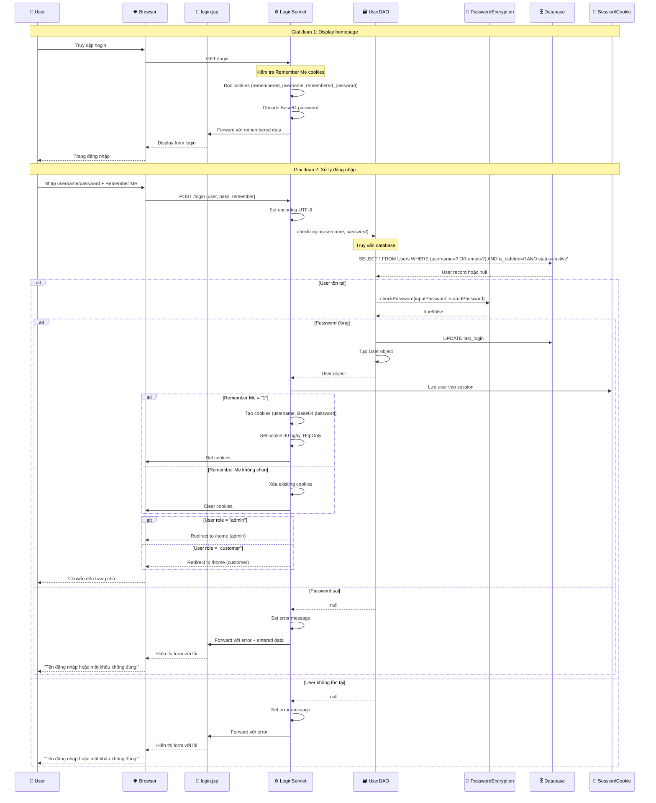
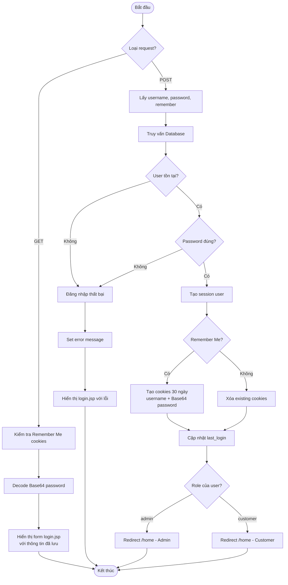
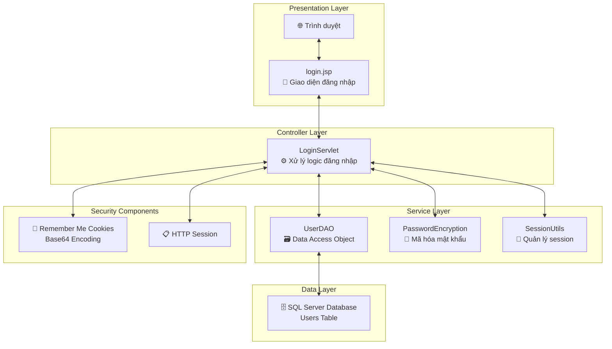
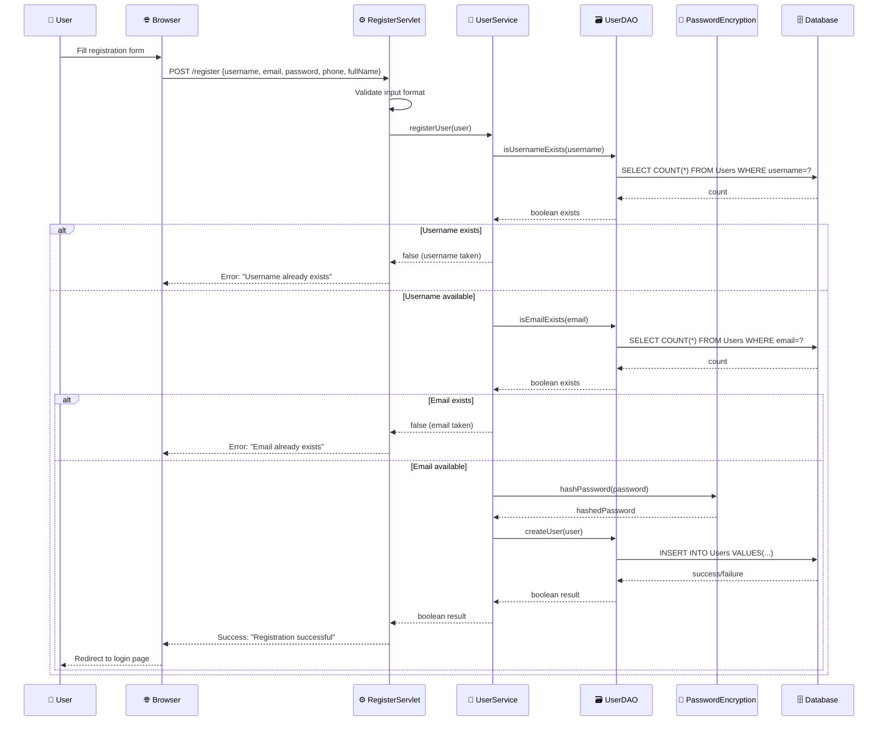
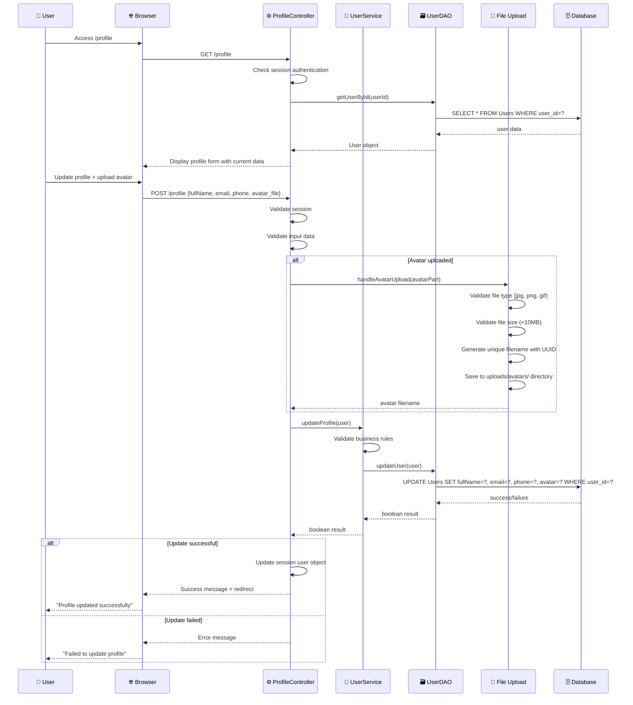
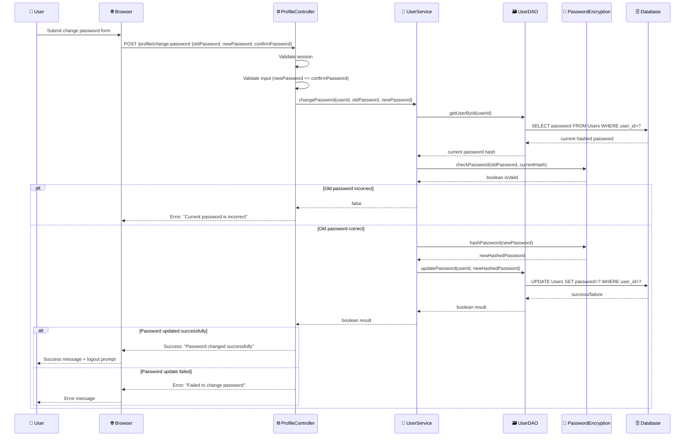
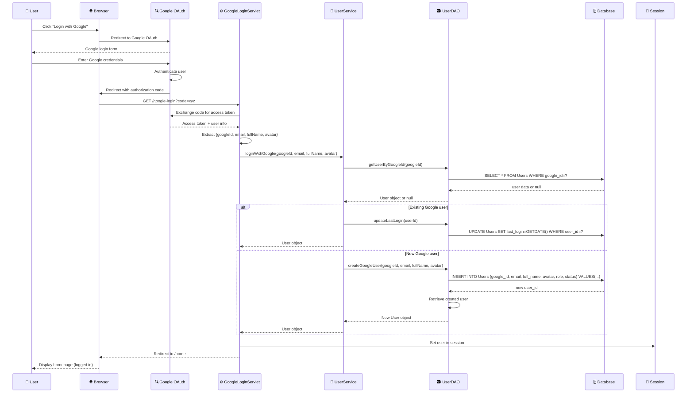

# Diagram Luồng Đăng Nhập - Dự Án Bán Cá Cảnh

## 1. Sequence Diagram - Luồng đăng nhập chi tiết



## 2. Flowchart - Luồng quyết định



## 3. Component Diagram - Kiến trúc hệ thống



## 4. Các đặc điểm bảo mật

### 🔐 Bảo mật mật khẩu:
- Sử dụng `PasswordEncryption.checkPassword()` để verify
- Mật khẩu được hash trước khi lưu DB

### 🍪 Remember Me:
- Lưu username và password (Base64) trong cookies
- Thời gian sống: 30 ngày
- HttpOnly flag để tránh XSS
- Path "/" cho toàn bộ domain

### 🛡️ Validation:
- Kiểm tra `is_deleted = 0` và `status = 'active'`
- UTF-8 encoding support
- SQL injection protection với PreparedStatement

### 📋 Session Management:
- Lưu User object trong session
- Redirect theo role (admin/customer)
- Update last_login timestamp

---

# Class Diagram, Specifications và Sequence Diagrams

## 5. Class Diagram - Kiến trúc tổng thể

```mermaid
classDiagram
    %% Entity Classes
    class User {
        -int userId
        -String username
        -String password
        -String email
        -String phone
        -String fullName
        -String role
        -String status
        -Timestamp createdAt
        -Timestamp lastLogin
        -String avatar
        -String googleId
        -boolean isDeleted
        +User()
        +User(username, password, email, phone, fullName)
        +getUserId() int
        +setUserId(int userId) void
        +getUsername() String
        +setUsername(String username) void
        +checkPassword(String password) boolean
        +isAdmin() boolean
        +isCustomer() boolean
    }

    class Product {
        -int productId
        -Integer categoryId
        -String name
        -String description
        -String shortDescription
        -BigDecimal price
        -BigDecimal salePrice
        -int quantity
        -String sku
        -String status
        -Integer featured
        -LocalDateTime createdAt
        -LocalDateTime updatedAt
        -Integer isDeleted
        +Product()
        +getProductId() int
        +getName() String
        +getPrice() BigDecimal
        +isAvailable() boolean
        +isFeatured() boolean
    }

    class Category {
        -int categoryId
        -Integer parentId
        -String name
        -String description
        -String status
        -int displayOrder
        -LocalDateTime createdAt
        -LocalDateTime updatedAt
        -Integer isDeleted
        +Category()
        +getCategoryId() int
        +getName() String
        +isActive() boolean
        +hasSubCategories() boolean
    }

    class BlogPost {
        -int postId
        -String title
        -String content
        -String summary
        -String thumbnail
        -String status
        -int authorId
        -int categoryId
        -LocalDateTime createdAt
        -LocalDateTime updatedAt
        -boolean isDeleted
        +BlogPost()
        +getPostId() int
        +getTitle() String
        +isPublished() boolean
    }

    class Wishlist {
        -int wishlistId
        -int userId
        -int productId
        -LocalDateTime createdAt
        +Wishlist()
        +getWishlistId() int
        +getUserId() int
        +getProductId() int
    }

    class Order {
        -int orderId
        -int userId
        -String orderNumber
        -BigDecimal totalAmount
        -String status
        -String paymentMethod
        -String shippingAddress
        -LocalDateTime createdAt
        -LocalDateTime updatedAt
        +Order()
        +getOrderId() int
        +getTotalAmount() BigDecimal
        +getStatus() String
        +isCompleted() boolean
    }

    %% Controller Classes
    class LoginServlet {
        +doGet(HttpServletRequest, HttpServletResponse) void
        +doPost(HttpServletRequest, HttpServletResponse) void
        -clearRememberMeCookies(HttpServletResponse) void
    }

    class ProfileController {
        -UserService userService
        -UserDAO userDAO
        +init() void
        +doGet(HttpServletRequest, HttpServletResponse) void
        +doPost(HttpServletRequest, HttpServletResponse) void
        -handleAvatarUpload(Part) String
        -validateProfileData(HttpServletRequest) boolean
    }

    class BlogController {
        -BlogService blogService
        +doGet(HttpServletRequest, HttpServletResponse) void
        +doPost(HttpServletRequest, HttpServletResponse) void
    }

    %% Service Interface Classes
    class UserService {
        <<interface>>
        +registerUser(User) boolean
        +login(String, String) User
        +loginWithGoogle(String, String, String, String) User
        +getUserById(int) User
        +updateProfile(User) boolean
        +changePassword(int, String, String) boolean
        +isUsernameExists(String) boolean
        +isEmailExists(String) boolean
    }

    class UserServiceImpl {
        -UserDAO userDAO
        +UserServiceImpl()
        +registerUser(User) boolean
        +login(String, String) User
        +updateProfile(User) boolean
        +changePassword(int, String, String) boolean
    }

    %% DAO Interface Classes
    class UserDAO {
        <<interface>>
        +createUser(User) boolean
        +getUserById(int) User
        +getUserByUsername(String) User
        +getUserByEmail(String) User
        +updateUser(User) boolean
        +deleteUser(int) boolean
        +checkLogin(String, String) User
        +updateLastLogin(int) void
    }

    class UserDAOImpl {
        +checkLogin(String, String) User
        +registerUser(User) boolean
        +getUserById(int) User
        +updateUser(User) boolean
        +updateLastLogin(int) void
        +isUsernameExists(String) boolean
        +isEmailExists(String) boolean
    }

    %% Utility Classes
    class PasswordEncryption {
        +hashPassword(String) String
        +checkPassword(String, String) boolean
        +generateSalt() String
    }

    class DBContext {
        +getConnection() Connection
        +closeConnection(Connection) void
    }

    class SessionUtils {
        +setUser(HttpSession, User) void
        +getUser(HttpSession) User
        +removeUser(HttpSession) void
        +isLoggedIn(HttpSession) boolean
    }

    %% Relationships
    User ||--o{ Wishlist : "has"
    User ||--o{ Order : "places"
    User ||--o{ BlogPost : "writes"
    Product ||--o{ Wishlist : "in"
    Category ||--o{ Product : "contains"
    Category ||--o{ BlogPost : "categorizes"
    
    LoginServlet --> UserDAO : "uses"
    LoginServlet --> PasswordEncryption : "uses"
    ProfileController --> UserService : "uses"
    BlogController --> BlogService : "uses"
    
    UserServiceImpl ..|> UserService : "implements"
    UserDAOImpl ..|> UserDAO : "implements"
    UserServiceImpl --> UserDAO : "uses"
    UserDAOImpl --> DBContext : "uses"
    UserDAOImpl --> PasswordEncryption : "uses"
```

## 6. Class Specifications

### 6.1 Entity Classes

#### **User Class**
```java
/**
 * Represents a user in the fish shop system
 * Supports both regular users and Google OAuth users
 */
public class User {
    // Fields: userId, username, password, email, phone, fullName, role, status, 
    //         createdAt, lastLogin, avatar, googleId, isDeleted
    
    // Key Methods:
    // - Constructor validation
    // - Role-based access control
    // - Password security
    // - Google OAuth integration
}
```

**Responsibilities:**
- Store user information and credentials
- Handle role-based permissions (admin/customer)
- Support OAuth authentication
- Maintain audit trail (createdAt, lastLogin)

**Key Attributes:**
- `userId`: Primary key, auto-generated
- `role`: "admin" | "customer" 
- `status`: "active" | "inactive" | "suspended"
- `googleId`: For Google OAuth users
- `isDeleted`: Soft delete flag

#### **Product Class**
```java
/**
 * Represents a fish product in the shop
 * Supports pricing, inventory, and categorization
 */
public class Product {
    // Fields: productId, categoryId, name, description, shortDescription,
    //         price, salePrice, quantity, sku, status, featured, timestamps
    
    // Key Methods:
    // - Price calculation with sale pricing
    // - Inventory management
    // - Featured product handling
}
```

**Responsibilities:**
- Store product information and pricing
- Manage inventory levels
- Handle featured/promotional products
- Support categorization

### 6.2 Service Layer Classes

#### **UserService Interface**
```java
/**
 * Business logic layer for user operations
 * Defines contract for user management
 */
public interface UserService {
    // Authentication operations
    User login(String username, String password);
    User loginWithGoogle(String googleId, String email, String fullName, String avatar);
    boolean registerUser(User user);
    
    // Profile management
    User getUserById(int userId);
    boolean updateProfile(User user);
    boolean changePassword(int userId, String oldPassword, String newPassword);
    
    // Validation operations
    boolean isUsernameExists(String username);
    boolean isEmailExists(String email);
}
```

**Responsibilities:**
- Define business rules for user operations
- Provide abstraction between controllers and data access
- Handle complex business logic validation
- Coordinate multiple DAO operations if needed

#### **UserServiceImpl Class**
```java
/**
 * Implementation of UserService interface
 * Contains business logic and validation rules
 */
public class UserServiceImpl implements UserService {
    private UserDAO userDAO;
    
    // Implements all interface methods with:
    // - Input validation
    // - Business rule enforcement
    // - Error handling
    // - Transaction coordination
}
```

### 6.3 Data Access Layer Classes

#### **UserDAO Interface**
```java
/**
 * Data access contract for user operations
 * Defines database operations without implementation details
 */
public interface UserDAO {
    // CRUD operations
    boolean createUser(User user);
    User getUserById(int userId);
    User getUserByUsername(String username);
    boolean updateUser(User user);
    boolean deleteUser(int userId);
    
    // Authentication specific
    User checkLogin(String username, String password);
    void updateLastLogin(int userId);
    
    // Query operations
    List<User> getAllUsers();
    boolean isUsernameExists(String username);
}
```

#### **UserDAOImpl Class**
```java
/**
 * SQL Server implementation of UserDAO
 * Handles all database interactions for user data
 */
public class UserDAOImpl implements UserDAO {
    // Uses PreparedStatement for SQL injection protection
    // Implements connection pooling via DBContext
    // Handles database-specific error scenarios
    // Supports both username and email login
}
```

### 6.4 Controller Classes

#### **LoginServlet**
```java
/**
 * Handles user authentication requests
 * Supports both regular login and Remember Me functionality
 */
@WebServlet("/login")
public class LoginServlet extends HttpServlet {
    // GET: Display login form with remembered credentials
    // POST: Process login attempt with session management
    // Includes cookie management for Remember Me feature
}
```

**Key Features:**
- Remember Me with Base64 encoding
- UTF-8 support for Vietnamese
- Role-based redirection
- Security cookie settings (HttpOnly)

## 7. Detailed Sequence Diagrams

### 7.1 User Registration Sequence



### 7.2 Profile Update Sequence



### 7.3 Password Change Sequence



### 7.4 Google OAuth Login Sequence



## 8. Architecture Summary

### 8.1 Layer Architecture
- **Presentation Layer**: JSP pages, Servlets (Controllers)
- **Business Layer**: Service interfaces and implementations
- **Data Access Layer**: DAO interfaces and implementations  
- **Database Layer**: SQL Server database

### 8.2 Design Patterns Used
- **MVC Pattern**: Controllers, Models, Views separation
- **DAO Pattern**: Data access abstraction
- **Service Layer Pattern**: Business logic encapsulation
- **Singleton Pattern**: Database connection management
- **Strategy Pattern**: Multiple authentication methods (regular/Google)

### 8.3 Security Features
- **Password Hashing**: BCrypt/PBKDF2 encryption
- **SQL Injection Protection**: PreparedStatement usage
- **Session Management**: HttpSession with proper timeout
- **Remember Me**: Secure cookie implementation with HttpOnly flag
- **Input Validation**: Both client-side and server-side validation
- **Soft Delete**: Logical deletion with isDeleted flag
